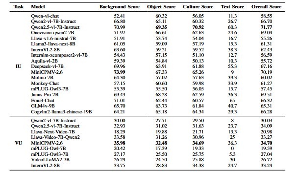
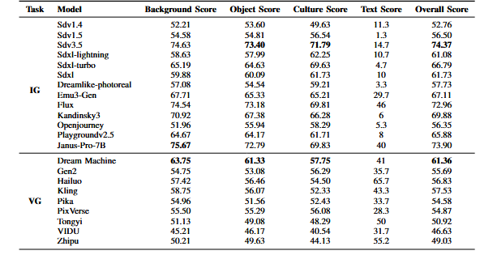
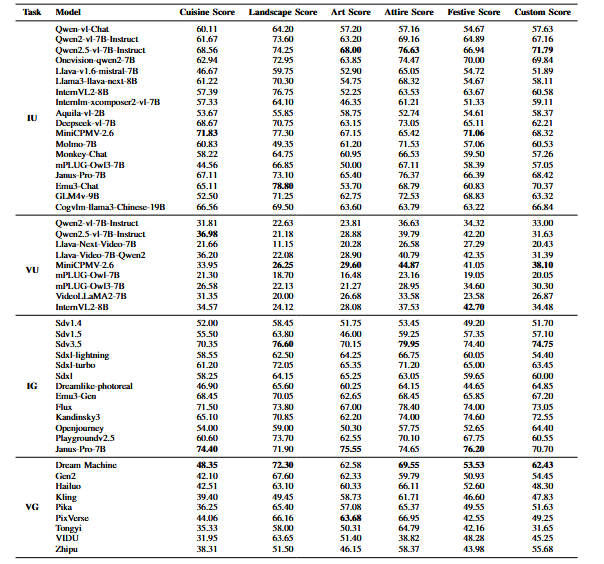

# MUGC
The implementation about the paper MUGC:Holistic Evaluation of Multimodal Understanding and Generation for Chinese Cultural Contexts.

## Introduction
we propose MUGC (Multimodal Understanding and Generation in Chinese Cultural Contexts), the first unified benchmark designed around Chinese cultural scenarios—an application domain rich in symbolic and aesthetic elements, and well-suited as a case study for evaluating multimodal models' ability to capture cultural semantics across image, video, and text modalities. We begin by assembling a diverse collection of Chinese‑style images and videos, generating initial captions with a pretrained vision–language model and refining them manually to form high‑quality image‑text and video‑text pairs. Next, we define a set of cultural attributes—such as object identity, background composition, and symbolic features—and employ an LLM‑based information extractor to convert free‑form captions into structured representations along these dimensions. An instruction‑tuned judge model then assigns interpretable scores for each attribute, and performance is quantified by win‑rate comparisons against a high‑quality reference model, yielding composite scores that jointly reflect semantic fidelity and cultural appropriateness.

## Experiment
We evaluated multiple MLLM models on both generation tasks (image understanding, video understanding) and understanding tasks (image generation,video generation) to verify their performance in comprehending and generating content in a Chinese style.

The image understanding (IU) open-source models we evaluated include CogVLM2, deepseek-vl-7b, qwen-vl-chat-7b, Emu3, GLM4v, internlm-xcomposer2-vl-7b, monkey-chat, llama3-llava-next-8b, llava-mistral-7b, MiniCPMv2.6-8b, onevision-qwen2, InternVL2, Molmo, qwen2-vl, qwen2.5-vl, mPLUG-Owl3-7b, Janus-Pro.

The video understanding (VU) open-source models we evaluated include mPLUG-Owl-video, mPLUG-Owl3-video, video-llama2, llava-next-video, InternVL2-video, llava-qwen-video, qwen2-vl, qwen2.5-vl, MiniCPM-video.

The image generation (IG) open-source models we evaluated include stable diffusion-v1.5, stable diffusion-v3.5, stable diffusion XL base 1.0, stable diffusion-v1.4, dream-like photo real, OpenJourney, Emu3-image, Kandinsky3, sdxl-lightning, sdxl-turbo, flux, Janus-image.

The closed-source video generation (VG) models we evaluated include Dream Machine, hailuo, tongyi, Gen2, Pika, Pixverse, kling, VIDU, and zhipu.

## Evaluation Result
Different tasks of MLLMs,including Image Understanding(IU),Video Understanding(VU).Comparison is made with GPT-4V outputs as the reference (score = 100)

Different tasks of MLLMs,including Image Generation(IG),Video Generation(VG).Comparison is made with GPT-4V outputs as the reference (score = 100)

Comparison of Six MLLM Subsets, including Image Understanding (IU), Video Understanding (VU), Image Generation (IG), and Video Generation (VG).Comparison is made with GPT-4V outputs as the reference (score = 100)

